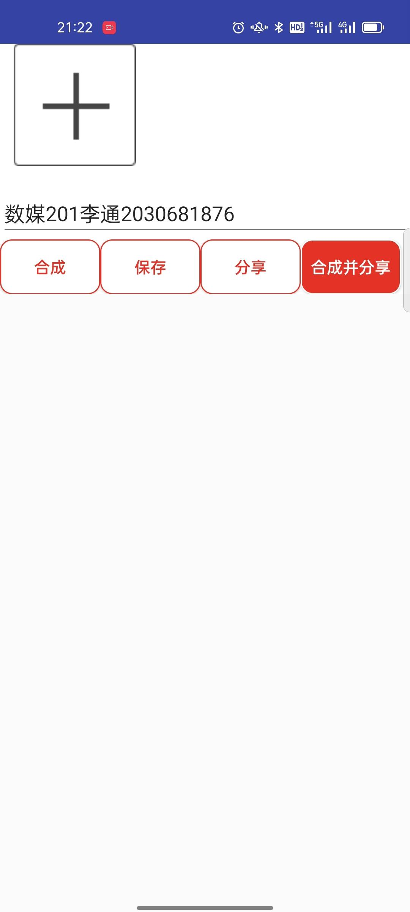
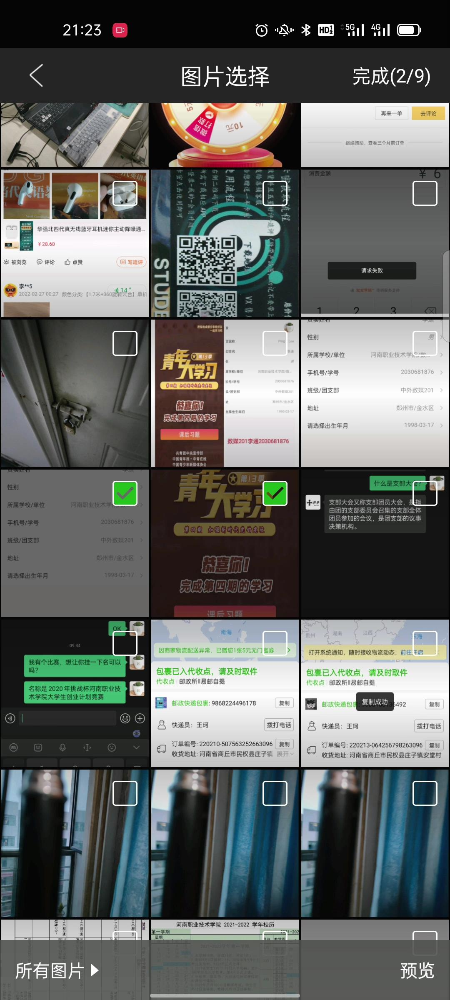
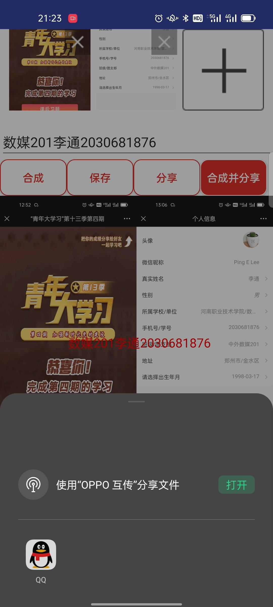

# HnzjImageTools
河职青年大学习拼图工具
## 需求描述
根据班级要求,观看完成青年大学习之后需要将青年大学习的两张图拼成一张图,并在两张图的中间添加自己信息的水印,并放送给学委
为了简化上面的操作,开发了该项目

## 主要功能
- 图片合并,添加水印
- 保存图片到本地
- 分享图片

## 演示截图
|主界面	|选择图片	|合成完成并分享	|
|--	|--	|--	|
|	|	|	|

演示地址

